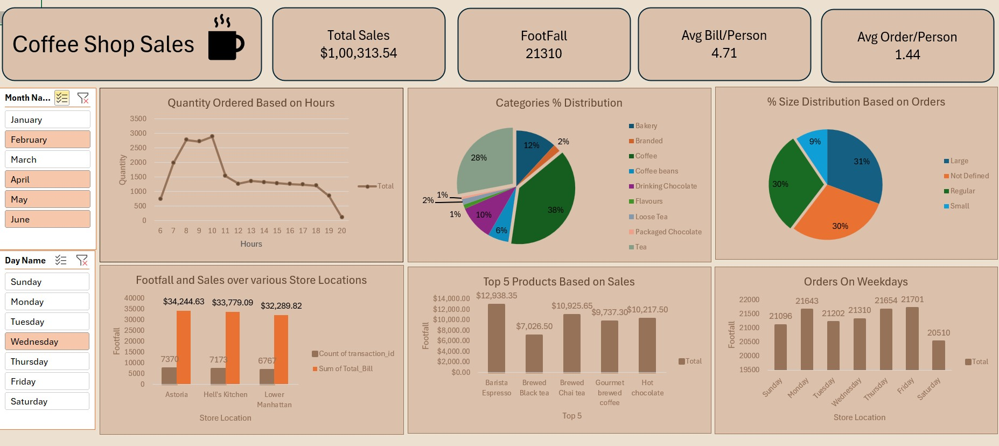

# ☕ Coffee Shop Sales Dashboard

This project is an **interactive sales dashboard** built in Excel to analyze the performance of a Coffee Shop chain.  
It provides insights into **sales, customer behavior, product categories, and store performance**, enabling **data-driven decision making**.  

## 📊 Dashboard Overview

## 🚀 Key Insights

- **Total Sales:** `$1,00,313.54`  
- **Footfall (Customers):** `21,310`  
- **Average Bill per Person:** `4.71`  
- **Average Orders per Person:** `1.44`  

### 🔹 Sales & Customer Trends
- Peak sales occur during **morning hours (8 AM – 10 AM)**.  
- **Coffee (38%)** is the highest-selling category.  
- **Large size drinks (31%)** are the most preferred.  
- Top product: **Barista Espresso** → `$12,938.35` in sales.  

### 🔹 Store Location Performance
- **Astoria** → `$34,244.63` sales with `7370` footfall (highest).  
- **Hell’s Kitchen** → `$33,779.09` sales with `7173` footfall.  
- **Lower Manhattan** → `$32,289.82` sales with `6767` footfall.  

### 🔹 Weekday Analysis
- **Friday** had the highest footfall → `21,701`.  
- **Saturday** saw the lowest customer traffic → `20,510`.  

## 🛠️ Tools & Technologies Used
- **Microsoft Excel** → Data analysis & visualization  
- **Power Query** → Data cleaning and transformation  
- **Pivot Tables & Charts** → Analytical breakdown  
- **Excel Dashboard Design** → KPIs, slicers, and charts  

## 📂 Project Files
- `Coffee_Shop_Sales.xlsx` → Main Excel dashboard  
- `README.md` → Documentation  

